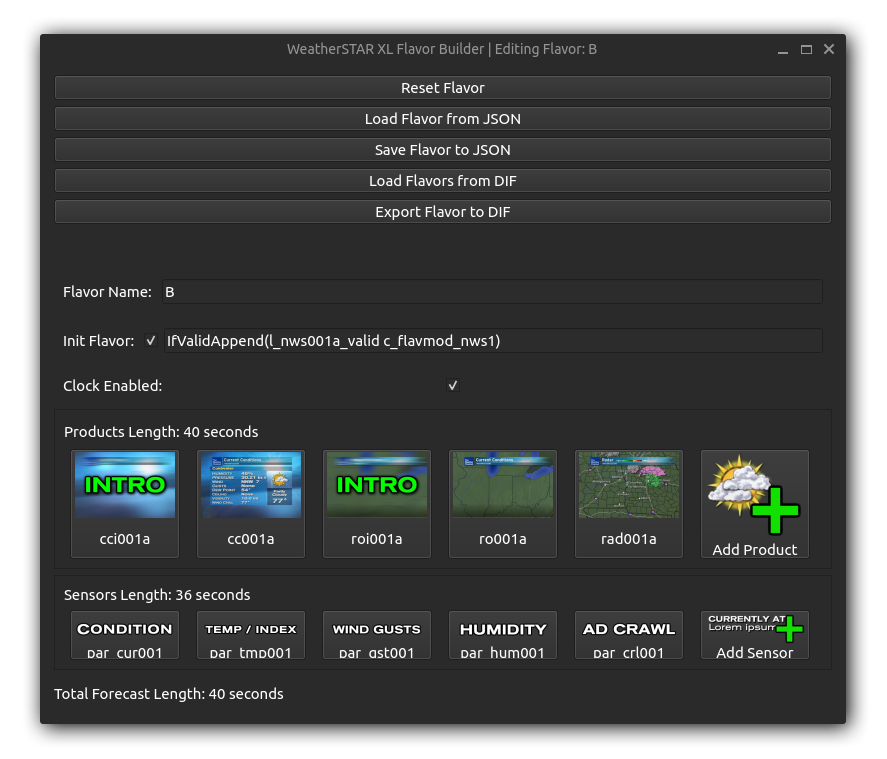

# WeatherSTAR XL Flavor Builder
**A simple and easy-to-use flavor manager for the WeatherSTAR XL, complete with DIF exporting for ease of installing custom flavors. Compatible with Windows, Linux, and probably Mac.**

With the Flavor Builder, you can:
- Create local forecast flavors
- Extract, load, and save flavors directly from the WeatherSTAR DIF
- Save/load flavors to your computer to modify at any time
- Export flavors in DIF format for easy import
- Customize product and sensor order
- Add flavor modifiers



## Setup
First, make sure you install the [requirements](https://github.com/MissMeridian/wsxl-flavor-builder/blob/main/requirements.txt).
```bash
pip install -r requirements.txt
```
Then run [FlavorBuilderGUI.py](https://github.com/MissMeridian/wsxl-flavor-builder/blob/main/FlavorBuilderGUI.py) with Python to get started.

## Using the Flavor Builder
### Flavor Management 
- **Reset Flavor**
  - Resets the active flavor configuration back to a blank state.
- **Load Flavor from JSON**
  - Load a previously saved flavor JSON file. Defaults to the "flavor-data" folder.
- **Save Flavor to JSON**
  - Save the active flavor configuration to a JSON file. Defaults to the "flavor-data" folder.
- **Load Flavors from DIF**
  - Extracts all flavors from a WeatherSTAR DIF file (either .txt or .dat) and opens a [new window](https://github.com/MissMeridian/wsxl-flavor-builder/blob/main/.github/dialog_extract.png) where you can:
    - Load a single selected flavor into the Flavor Builder for editing
    - Save selected flavor(s) to your computer as JSON files
    - Save all discovered flavors to your computer as JSON files
- **Export Flavor to DIF**
  - Outputs your flavor configuration as an importable .txt file for the WeatherSTAR XL.
### Flavor Editing
- **Flavor Name**
  - The callable name of the flavor as used by PelOrion. Must only be uppercase alphanumerical characters.
- **Init Flavor**
  - **Checkbox:** Determines whether the flavor name will be initialized as callable by PelOrion.
  - **Modifiers field:** Optionally appends the flavor name modifier string to the Init value.
    - The modifier string can be used to append additional letters to the flavor name when called under certain conditions.
- **Clock Enabled**
  - If checked, the clock element will be added to the misc layer for the entirety of the forecast length.
- **Products & Sensors**
  - Add a product/sensor by name, and set the duration for it to display.
  - You can the name and duration of existing products/sensors with the same menu.
  - Right clicking a product/sensor will reveal a context menu revealing additional options:
    - You can change the position of a product/sensor in the flavor sequence

## Support and Feedback
If you experience problems with the Flavor Builder, please report them in [issues](https://github.com/MissMeridian/wsxl-flavor-builder/issues). Provide as much information as possible, including the version of Python you're running.

If there are features or improvements you'd like to see in this project, feel free to implement them yourself and submit a pull request when finished. I will try to maintain this repository as best as possible, but I may not be around to respond quickly.
 
## To-Do
- Add product/sensor definitions to product-data and sensor-data as parseable JSON. (Could include human names for each product/sensor, and whether the product is an intro, or has an associated intro)
- "Add intro" checkbox when adding applicable products
- Multi-flavor DIF exports
